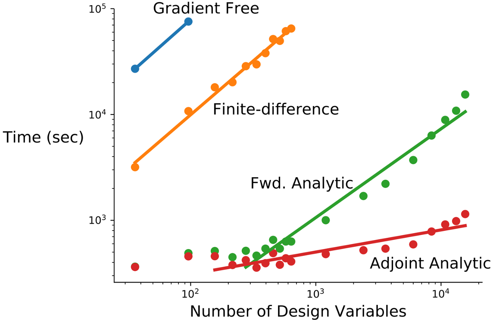
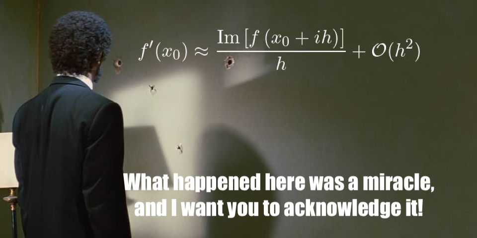
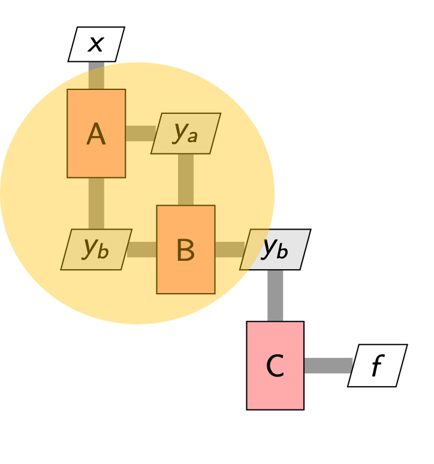
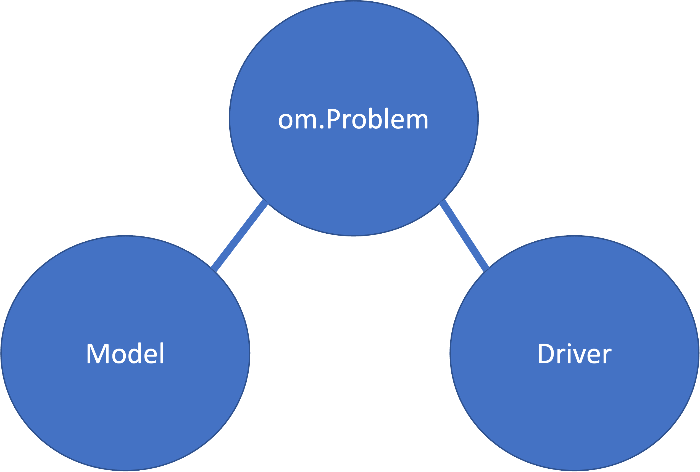

# OpenMDAO Training 2023
## Part 01: Hello, ~~World~~ OpenMDAO

---

## Agenda

1. Overview of OpenMDAO
2. Installing OpenMDAO
3. The basics
    - Problems
    - Models
        - Components
        - Groups
    - Drivers

---

# What is OpenMDAO?

OpenMDAO is a Python framework that provides an interface from user-developed models to optimizers, with a focus on gradient-based optimization

---

# Why gradient-based?

---

 

<style scoped>
a {
  font-size: 18px;
}
</style>

[Lyu, Xu, and Martins, _Benchmarking Optimization Algorithms for Wing Aerodynamic Design Optimization_, ICCFD8-2014-0203](http://websites.umich.edu/~mdolaboratory/pdf/Lyu2014f.pdf)

---

# What's wrong with finite differencing?

---

# Issue #1 Performance

```
nominal_value = f(x)
h = 1.0E-6
for i in range(1000):
    x[i] += h
    perturbed_value = f(x[i])
    x[i] -= h
    fd[i] = (perturbed_value - nominal_value) / h
```

- Many evaluations of `f` (slow)
- Subtractive cancellation (inaccurate)

---

# And then things get worse...

What if our model `f` is implicit?
```
def f(x, tol=1.0E-6):
    while abs(x - x_prev) > tol:
       ...
    x_prev = x
    return g(x)
```

- Many _more_ evaluations of `f` (even slower)
- If the perturbation in $x$ results in a change less than `tol` $\longrightarrow$ no change in $f$ $\longrightarrow$ errant $0$ derivative!

---

# What are the alternatives?

---

# Complex-Step

- Perturb imaginary component of inputs.
- Perturbation can be ridiculously small...no subtractive cancellation.
- If function is _analytic_ (complex-safe), then

$$
\begin{align}
f^\prime(x_0) \approx \frac{\mathrm{Im}[f(x_0 + ih)]}{h} + \mathcal{O}(h^2)
\end{align}
$$

---


 

---

# Complex-Step Pros
- Accurate derivative (machine precision)
- No worrying about step size, converges rapidly to machine precision but set $h=1E-40$ and don't worry about it.
# Complex-Step Cons
- Still slow (slower than FD actually)
- Need to know that your model is "complex-safe"

---

# Analytic Derivatives Pros

- Perfect accuracy
- Inexpensive

# Analytic Derivatives Cons

- Upfront developer cost _(but who doesn't love taking derivatives?)_
- Can be alleviated somewhat by AD

<!-- ---

# How do we take the derivative of $y_b$ across the iterative loop?

|               |               |
| ------------- | ------------- |
|  | $\frac{df}{dx} = \frac{\partial f}{\partial y_b} \frac{\partial y_b}{\partial y_a} \frac{\partial y_a}{\partial x} + \frac{\partial f}{\partial y_b} \frac{d y_b}{d x} + \frac{\partial f}{\partial y_a} \frac{d x}{d x}$  | -->

---

# Basics of the OpenMDAO API

# `import openmdao.api as om`

---

 

---

# Model

- System
    - Components that perform calculations
    - Groups of components
- Nonlinear Solvers
    - Reduce residuals to zero
- Linear Solvers
    - Used to assemble total derivatives from partials

---

# Drivers

- Repeatedly execute Model with various inputs
    - Gradient based optimizers
    - Gradient-free optimizers
    - Design of Experiments (DOE)

---

# Our First Example

- The ParabComp
    - Takes two inputs $x$ and $y$
    - Compute a corresponding $f_{xy}$

---

(show the code for the paraboloid here)

---

(show the code for the corresponding problem here)

#